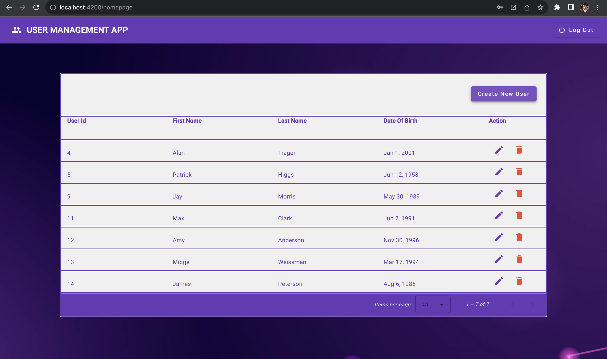

# UserManagementApp

A simple User Management App with Angular UI and Asp.NET Core WEB API.

## Directory Structure

```
|--- UserManagementApp  (AngularClient)
    |--- ...
|--- UserManagementAPI  (API)
    |--- ...
```


## FRONTEND 

  This project was generated in **Angular CLI 16.2.2**.
  
  Run all commands from the `UserManagementApp` folder.

  ### Code scaffolding
  - Run `ng generate component <component-name>` to generate a new component.
  - You can also use `ng generate <directive|pipe|service|class|guard|interface|enum|module>`.
  
  ### Development server
  - Run `ng serve` for a dev server.
  - Navigate to http://localhost:4200/
  - The application will automatically reload if you change any of the source files.
  
  ### WorkFlow

  1. Login Screen - **LoginComponent**
     
     

  2. Home Screen on successful login - **UserManagementComponent**
     
     


  3. To Add New User - **UserCreateEditComponent**

      

  4. To modify existing User, UserCreateEditComponent has been reused


## BACKEND

  - A full **CRUD REST API** has been implemented in ASP.NET CORE WEB API (target Framework: .NET 7.0)

  - The User Data from the angular client application is stored into **SQLite** Database via this REST API

  - API Routes are protected using JWT tokens

  - JWT Authentication has been implemented in AuthController

  - Authorization is required for all API Requests to UserInfo controller

  - Swagger documentation has been implemented for this API

  - For further information of the API such as Endpoint URL, Request and Response Models,
    - Build the **UserMangementAPI** solution 
    - Run with UserManagementAPI as Startup Project 
    - Navigate to https://localhost:5001/swagger/index.html

    - API Swagger page
    

## Note: Please contact me for the default credential used for login.
  
